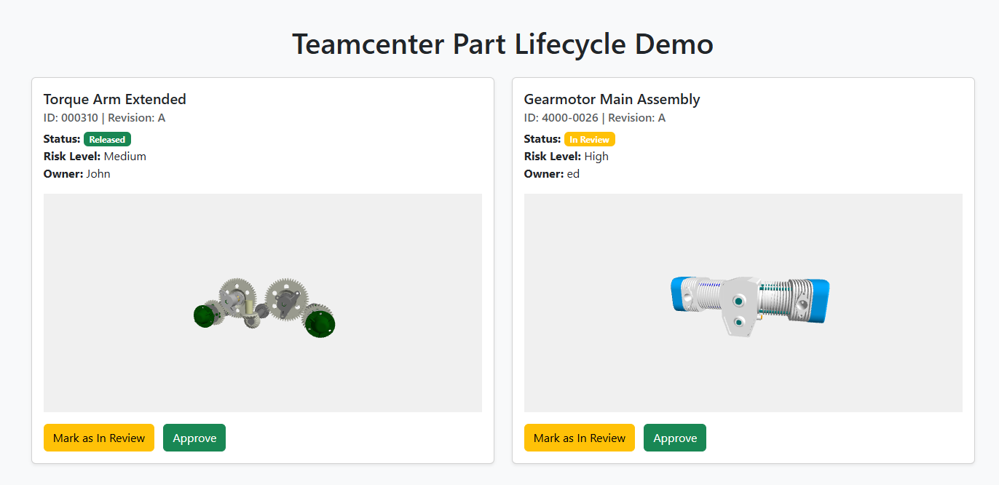
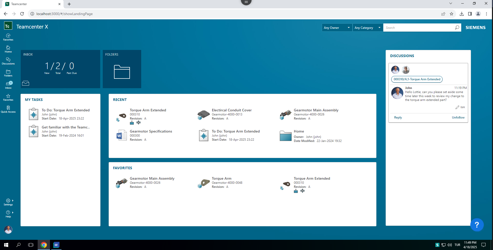
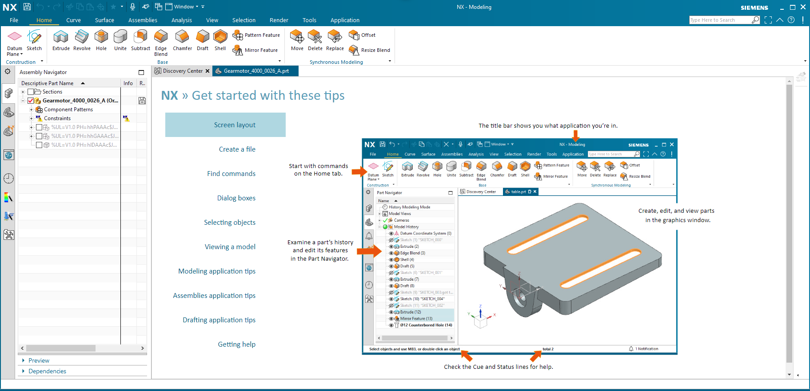
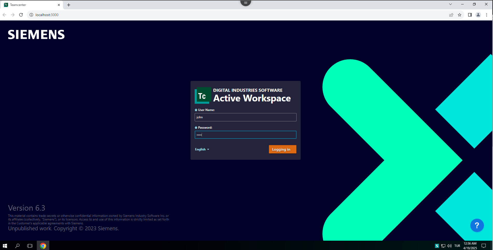

# Teamcenter PLM Demo

<video width="100%" controls>
  <source src="assets/TC-demo.mp4" type="video/mp4">
  Your browser does not support the video tag.
</video>

A demonstration of a lightweight PLM (Product Lifecycle Management) system inspired by Teamcenter, showcasing part lifecycle management and 3D model visualization capabilities.




## Overview

This project demonstrates a simplified version of enterprise PLM functionality, specifically focusing on part lifecycle management and 3D visualization. The implementation is based on real-world experience with Siemens Teamcenter, showcasing key PLM concepts in a modern web application.

## Features

- **Part Lifecycle Management**: Track and manage the status of parts through their lifecycle stages (Draft → Review → Released)
- **3D Model Visualization**: Interactive 3D viewer for CAD models using Three.js
- **Risk Level Assessment**: Built-in risk evaluation system for parts
- **Real-time Updates**: Instant status updates and notifications
- **Responsive Design**: Modern UI that works across devices

## TeamCenter Integration Experience

The design of this demo is informed by hands-on experience with Siemens TeamCenter PLM system. Here's how we leveraged TeamCenter's concepts:

### Data Export Process


The part data structure and lifecycle states are modeled after TeamCenter's approach to PLM. We used the TeamCenter interface to understand and replicate the essential workflows for part management.

### CAD Integration


The 3D visualization feature demonstrates the integration capabilities similar to TeamCenter's NX CAD integration, showing how engineering data can be made accessible through a web interface.

### Secure Access


While this is a demo, the architecture considers enterprise-grade security patterns used in TeamCenter, including proper authentication and authorization flows.

## Technical Stack

- **Frontend**: HTML5, JavaScript, Three.js for 3D visualization
- **Backend**: Node.js, Express
- **Data Storage**: JSON-based data store
- **3D Support**: glTF format for 3D models

## Getting Started

1. Clone the repository:
   ```bash
   git clone https://github.com/yourusername/teamcenter-plm-demo.git
   ```

2. Install dependencies:
   ```bash
   cd teamcenter-plm-demo
   cd backend && npm install
   ```

3. Start the backend server:
   ```bash
   npm start
   ```

4. Open `frontend/index.html` in your browser

## Development

The project is structured to demonstrate PLM concepts while maintaining simplicity:

- `frontend/`: Contains the web interface and 3D viewer
- `backend/`: Houses the Node.js server and API endpoints
- `assets/`: Stores demo files and documentation assets

## Contributing

Contributions are welcome! Please feel free to submit a Pull Request.

## License

This project is licensed under the MIT License - see the LICENSE file for details.

## Acknowledgments

- Inspired by Siemens TeamCenter PLM system
- 3D viewer powered by Three.js
- Sample 3D models from Khronos glTF samples
